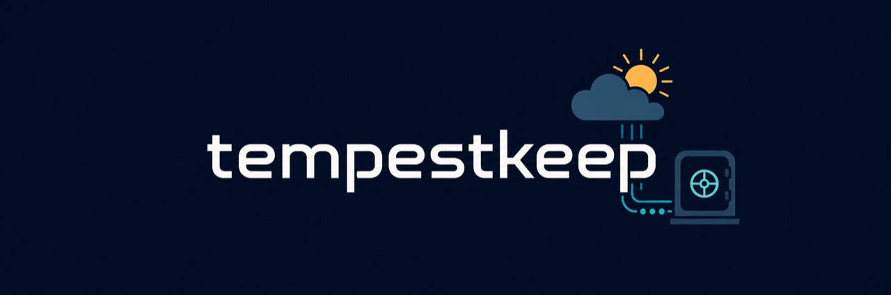
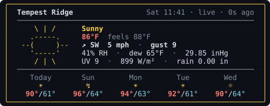

# TempestKeep

[![Development version][version-badge]](CHANGELOG.md)
[![CI][ci-b]][ci]
[![OpenSSF Best Practices][best-practices-badge]][best-practices]
[![License][license-badge]](LICENSE)
[![Go version][go-badge]][go-install]
[![Go Reference][docs-badge]][go-docs]
[![GitHub stars][stars-badge]][stars]

TempestKeep reads WeatherFlow Tempest data. The `tempestkeep` command provides
setup, collection, export, reports, terminal views, and an MCP stdio server. It
stores one-minute observations in a local SQLite archive.

The archive stays on the local machine. TempestKeep sends authenticated read
requests to the WeatherFlow REST API when a live operation or collection needs
data.

## Requirements

- Go 1.27.0.
- A WeatherFlow personal access token for live data or collection.
- A local filesystem for the active SQLite archive.

The normal build is pure Go and uses `CGO_ENABLED=0`. Race tests need a C
toolchain.

## Quickstart

Obtain the source over HTTPS:

```sh
git clone https://github.com/lennrt/tempestkeep.git
cd tempestkeep
```

Check the toolchain and build the command:

```sh
go version
# The result must start with: go version go1.27.0

go mod download
make build
export PATH="$PWD/bin:$PATH"
```

Keep the directory that contains `tempestkeep` on `PATH` when the MCP client
starts. Then run the setup wizard:

```sh
tempestkeep setup
```

The wizard validates the token, selects an archive path, and prints MCP setup
guidance.

For manual setup, copy `.env.example` to `.env`, set `TEMPEST_TOKEN`, and limit
the file to the current user:

```sh
cp .env.example .env
chmod 600 .env
./bin/tempestkeep list-devices
./bin/tempestkeep collect
```

Do not put a token on a command line. Command lines can be retained in shell
history and process diagnostics. Rotate a token after any exposure.

## Main commands

```text
tempestkeep setup          Configure the token and archive.
tempestkeep list-devices   List stations and device identifiers.
tempestkeep collect        Create or update the archive.
tempestkeep now            Show current conditions and forecast.
tempestkeep explore        Explore archived days, months, and records.
tempestkeep stats          Print archive statistics.
tempestkeep export         Write CSV or JSON Lines to stdout.
tempestkeep mcp            Serve live and archived data over MCP stdio.
tempestkeep version        Print the installed version.
tempestkeep help           Show command help.
```

Use `tempestkeep help <command>` for flags, bounds, results, and failure behavior.
Machine-readable commands keep data on stdout and diagnostics on stderr.



## Terminal controls

The current-conditions card needs 61 columns; the explorer needs 68. Narrower
windows show a resize notice rather than a broken border. On short terminals,
use **Up/Down** (or **k/j**) and **Page Up/Page Down** to scroll. A position hint
appears when content extends beyond the screen. Resizing returns to the top.

In `now`, **r** refreshes or retries. In `explore`, **Enter** refreshes or retries,
**Left/Right** (or **h/l**) scrubs periods, **d/w/m/y/r** selects a view, **Tab**
cycles the month/year metric, and **g/Home** returns to the latest period.
**q**, **Esc**, and **Ctrl+C** exit either dashboard.

Source builds without release metadata identify as `v0.2.0-dev`. See
[CHANGELOG.md](CHANGELOG.md) for the pending minor-version changes.

## Archive behavior

Each archive belongs to one device. TempestKeep rejects a second device because
mixed rows would invalidate rain, wind, and temperature aggregates.

Collection requests at most five days per API call. Each chunk is committed in
one transaction. Observation inserts use the `(device_id, epoch)` key, so replay
does not create duplicate rows. Open-ended collection stores a cursor after each
committed chunk and resumes from that cursor after interruption.

The default `tempestkeep collect` run creates a timestamped backup after a
successful checkpoint. A backup is first copied to a private temporary file and
then linked into place without overwriting an existing snapshot. Set
`--backup-keep` from 0 through 365. A value of 0 disables backups.

Keep the active database on a local filesystem. Stop writers before copying the
database. Move a completed backup or export between machines. Do not place an
active WAL database in a cloud-synchronized folder.

The archive stores SI units. The CLI and MCP display layers convert values when
they promise US units. Calendar summaries use the process timezone. Set `TZ` to
the station's IANA timezone before running calendar reports on a host with a
different timezone.

## MCP server

Run the server over stdio:

```sh
./bin/tempestkeep mcp --db ./tempest.sqlite
```

Pass `TEMPEST_TOKEN` and `TEMPEST_DB` through the MCP client's environment
configuration. Do not place the token in repository files or command arguments.

Capabilities depend on available inputs:

| Inputs | Available operations |
|---|---|
| token | live conditions, station metadata, and forecast |
| archive | local observations, summaries, records, and read-only SQL |
| token and writable archive | bounded archive backfill and sync |

Use `--read-only` or `TEMPEST_READ_ONLY=true` to remove archive write tools.
MCP stdout carries JSON-RPC only. Diagnostics use stderr and omit credentials,
archive paths, raw identifiers, and response payloads.

The optional package under `plugin/` connects `tempestkeep mcp` to Claude Code.
Review its metadata and installation flow before distribution.

## Security and privacy

Treat these files as sensitive:

- `.env` and access tokens;
- the SQLite archive, WAL, and shared-memory files;
- backups and exports; and
- terminal output that lists station, device, coordinate, or serial data.

These paths are ignored by Git. The application requests owner-only permissions
where the platform supports them. See [SECURITY.md](SECURITY.md) for private
reporting guidance and [docs/threat-model.md](docs/threat-model.md) for trust
boundaries, controls, and residual risks.

## Verification

Run the repository checks with Go 1.27.0:

```sh
make fmtcheck       # gofmt and goimports
make docs-check     # Markdown format and local links
make tidy-check     # go.mod and go.sum drift
make vet
make test           # pure-Go tests
make race
make fuzz           # bounded fuzz smoke tests
make lint
make workflows       # GitHub Actions syntax and semantics
make generated      # public API snapshot
make vuln
make licenses
make sbom
make secrets        # tracked files and Git history
make build-pure
make build-arm64
```

`make verify` runs the full set. Tests use finite timeouts. HTTP and MCP end-to-
end tests use local deterministic servers and do not need a token. A live smoke
test needs an explicit test token in the process environment:

```sh
# Load TEMPEST_TOKEN from a private secret manager first.
make live-smoke
unset TEMPEST_TOKEN
```

The command lists devices, fetches current conditions and a forecast, collects
one bounded history range, reads the temporary archive without a token, and then
deletes the archive. It discards API output. Do not run it with a production
token.

CI runs on pushes to `main`, pull requests, and manual dispatch. It uses Ubuntu
runners and cancels obsolete runs. Demo recording and release qualification are
manual. Release qualification builds a snapshot and does not publish it.

Use the [documentation index](docs/README.md) to find command guides, design
records, security evidence, support policy, and release procedures. See
[CONTRIBUTING.md](CONTRIBUTING.md) before proposing a change.

## Verification scope

- The repository checks do not include a production load test or formal
  verification.
- No Antithesis run has been launched or recorded.
- Live behavior depends on the WeatherFlow service and the permissions of the
  supplied token.
- CodeQL, dependency review, and some repository security features can require
  GitHub Advanced Security for a private repository.

## Contribute and report problems

Use [GitHub Issues][issues] for bugs, feature requests, and public discussion.
English reports and contributions are welcome. See [SUPPORT.md](SUPPORT.md)
for useful diagnostics and [CONTRIBUTING.md](CONTRIBUTING.md) for the pull
request process, coding rules, and required tests. Report vulnerabilities
privately using [SECURITY.md](SECURITY.md).

The OpenSSF badge above displays the live status of the existing project entry.
The [OpenSSF evidence guide](docs/openssf.md) maps the Passing criteria to the
repository's controls and records the assessment date and limits.

## Affiliation

TempestKeep is an independent project. It is not affiliated with, endorsed by,
or sponsored by WeatherFlow or the Tempest weather platform. WeatherFlow and
Tempest names and marks belong to their respective owners. See [NOTICE.md](NOTICE.md).

## License

TempestKeep uses the MIT License. See [LICENSE](LICENSE).

[version-badge]: https://img.shields.io/badge/development-v0.2.0--dev-blue
[ci-b]: https://img.shields.io/github/actions/workflow/status/lennrt/tempestkeep/ci.yml?branch=main
[ci]: https://github.com/lennrt/tempestkeep/actions/workflows/ci.yml
[license-badge]: https://img.shields.io/github/license/lennrt/tempestkeep
[go-badge]: https://img.shields.io/github/go-mod/go-version/lennrt/tempestkeep
[go-install]: https://go.dev/doc/install
[docs-badge]: https://img.shields.io/badge/Go-reference-00ADD8?logo=go&logoColor=white
[go-docs]: https://pkg.go.dev/github.com/lennrt/tempestkeep
[stars-badge]: https://img.shields.io/github/stars/lennrt/tempestkeep?style=flat
[stars]: https://github.com/lennrt/tempestkeep/stargazers
[best-practices-badge]: https://www.bestpractices.dev/projects/14460/badge
[best-practices]: https://www.bestpractices.dev/en/projects/14460/passing
[issues]: https://github.com/lennrt/tempestkeep/issues
