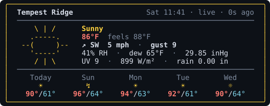

# TempestKeep

[![Development version][version-badge]](CHANGELOG.md)
[![CI][ci-b]][ci]
[![OpenSSF Best Practices][best-practices-badge]][best-practices]
[![License][license-badge]](LICENSE)
[![Go version][go-badge]][go-install]
[![Go Reference][docs-badge]][go-docs]
[![GitHub stars][stars-badge]][stars]

TempestKeep is a [Model Context Protocol (MCP)](https://modelcontextprotocol.io/)
server and command-line tool for WeatherFlow Tempest. An MCP client can request
live conditions, forecasts, and historical queries. TempestKeep can collect
history into a local SQLite archive and resume interrupted collection.

One Go executable serves MCP over stdio, the client's standard input and output.
The same executable provides a terminal dashboard, reports, and CSV or JSON Lines
exports. An existing archive works without a WeatherFlow token.

[![MCP discovery, archive backfill, chained queries, and offline reuse][mcp-demo]][mcp-video]

[Watch the MP4 clip][mcp-video] · [Run the demo locally](#try-it-without-a-station)
· [Connect your agent](#connect-your-agent) · [CLI and terminal UI](#cli-and-terminal-ui)

The clip uses synthetic weather and a scripted Go client. Discovery, tool calls,
archive writes, and the final session without an API token all run through the
real MCP server. No LLM or WeatherFlow account is needed to replay it.

## What your agent can do

With live access and a writable archive, TempestKeep exposes 29 typed tools,
2 resources, and 3 prompts. Each tool has an input schema and structured output.

| Ask your agent | MCP workflow |
|---|---|
| "Build my station's archive and keep it current." | `archive_status` → resumable `backfill_archive` → `sync_archive` |
| "Which day had the strongest gust in the last 30 days?" | `daily_summary` → `get_observations` for that day |
| "Where does the wind usually come from?" | `wind_rose` over the local archive |
| "Is today's weather unusual for this station?" | `current_conditions` → `this_day_in_history` → `records` |
| "Explain the archive before writing a query." | Read the schema and data-dictionary resources, then use `query_sql` |

The `weather_report`, `climate_review`, and `build_archive` prompts package
common workflows. The resources explain the schema, units, and aggregation
rules so a client can work with the stored data.

Capabilities follow configuration:

| Inputs | Available operations |
|---|---|
| token | live conditions, station metadata, and forecast |
| archive | local observations, archive status, summaries, records, and read-only SQL |
| token and writable archive | bounded archive backfill and sync |

Use `--read-only` or `TEMPEST_READ_ONLY=true` to remove MCP archive write tools.
Live API reads remain available when a token exists. SQL queries use a read-only
database handle and limits on time, rows, and bytes. Open-ended backfill calls
save progress between bounded batches.

See the [MCP guide](docs/mcp.md) for configuration, capabilities, and limits.

## Connect your agent

### Build

You need Go 1.27.0 and a local filesystem for SQLite. Live data and collection
also need a WeatherFlow personal access token. The build commands below use
`make` and a Unix-like shell. The normal build uses pure Go. Race tests need
a C toolchain.

```sh
git clone https://github.com/lennrt/tempestkeep.git
cd tempestkeep
go mod download
make build
```

The executable is `bin/tempestkeep`. Use its absolute path in a desktop MCP
client, or put it on that client's `PATH`.

For a build without `make`, run `go build -o bin/tempestkeep ./cmd/tempestkeep`.
On native Windows, use `bin/tempestkeep.exe` as the output filename and client
command. Direct Go builds use the module version metadata when Go supplies it.

### Configure the MCP client

For clients that use an `mcpServers` configuration, add the following to the
client's private local configuration. Replace the paths, token placeholder,
and timezone with your own values:

```json
{
  "mcpServers": {
    "tempestkeep": {
      "command": "/absolute/path/to/tempestkeep/bin/tempestkeep",
      "args": ["mcp"],
      "env": {
        "TEMPEST_TOKEN": "YOUR_WEATHERFLOW_TOKEN",
        "TEMPEST_DB": "/absolute/path/to/weather/tempest.sqlite",
        "TZ": "America/Los_Angeles"
      }
    }
  }
}
```

Use your client's secret store if it provides one. Keep credentials out of Git
and command arguments. Clients with a different configuration format need the
same command, arguments, and environment values.

Restart or reconnect the MCP client, then ask it to build your station's local
archive. With a token and explicit database path, TempestKeep creates the archive
and exposes the backfill tools. Collection happens when the client calls those
tools. Starting the server does not install a background collector.

For an existing archive without live access, omit `TEMPEST_TOKEN` and add
`--read-only` to `args`. Also remove any token inherited from the process
environment or loaded from `.env`. The server reads `.env` from its working
directory, which can differ from your terminal's directory.

If the token can access several devices, read the
[device selection rules](docs/mcp.md#capabilities) before collecting.

The host launches `tempestkeep mcp` and exchanges JSON-RPC over stdin/stdout.
Diagnostics go to stderr. SIGINT and SIGTERM cancel work and close the archive.
The archive remains local. Tool results go to the connected MCP client, which
can send them to its model provider.

The optional [Claude Code plugin](plugin/README.md) uses the same server.

## Try it without a station

Run the same MCP session shown above with a local synthetic API and a temporary
archive. No real token or model provider is used:

```sh
make mcp-demo
```

The demo discovers capabilities and builds 45 days of history. It uses a daily
summary to select an hourly query, then reconnects without a token in read-only mode.
It removes its temporary archive and stops the synthetic API when finished.

To record the GIF and MP4 with [Charm's VHS][vhs], install VHS v0.11.0, `ttyd`,
and `ffmpeg`, then run:

```sh
make demo-agent
```

The recording is defined in [docs/agent.tape](docs/agent.tape), with a
[reproduction guide](docs/demo.md) covering the transcript and recording checks.

## CLI and terminal UI

The CLI gives you direct access to the same live data and archive. Start with
the interactive setup wizard, then collect history and open the dashboard:

```sh
./bin/tempestkeep setup
./bin/tempestkeep collect
./bin/tempestkeep now
./bin/tempestkeep explore
```

For manual setup on Unix-like systems, copy `.env.example` to `.env` and run
`chmod 600 .env` before entering the token. Commands read that file from their
current working directory. Use the [CLI guide](cmd/tempestkeep/README.md) for
configuration, collection, protected exports, and report examples.

```text
tempestkeep setup          Configure the token and archive.
tempestkeep list-devices   List stations and device identifiers.
tempestkeep collect        Create or update the archive.
tempestkeep now            Show current conditions and forecast.
tempestkeep explore        Explore archived days, months, and records.
tempestkeep stats          Print archive statistics.
tempestkeep export         Write CSV or JSON Lines to stdout.
tempestkeep mcp            Serve live and archived data over MCP stdio.
tempestkeep version        Print the installed version.
tempestkeep help           Show command help.
```

Use `tempestkeep help <command>` for flags, bounds, results, and failure behavior.
Machine-readable commands keep data on stdout and diagnostics on stderr.



## Terminal controls

The current-conditions card needs 61 columns. The explorer needs 68. Narrower
windows show a resize notice. On short terminals,
use Up/Down (or k/j) and Page Up/Page Down to scroll. A position hint
appears when content extends beyond the screen. Resizing returns to the top.

In `now`, `r` refreshes or retries. In `explore`, Enter refreshes or retries,
Left/Right (or h/l) moves between periods, `d/w/m/y/r` selects a view, and Tab
cycles the month/year metric. The `g` or Home key returns to the latest period.
The `q`, Esc, and Ctrl+C keys exit either dashboard.

`tempestkeep version` reports the build's injected version, then Go's module
version when available. If neither exists, it falls back to `v0.2.0-dev`.
`make build` injects a version from Git tags or that development fallback.
See [CHANGELOG.md](CHANGELOG.md) for the pending minor-version changes.

## Archive behavior

Each archive belongs to one Tempest device. Collection supports `obs_st`
observations from Tempest ST hardware. TempestKeep rejects another device's
rows because mixed observations invalidate rain, wind, and temperature totals.

Collection requests at most five days per API call. Each chunk is committed in
one transaction. Observation inserts use the `(device_id, epoch)` key, so replay
does not create duplicate rows. Open-ended collection stores a cursor after each
committed chunk and resumes from that cursor after interruption.

The default `tempestkeep collect` run creates a timestamped backup after a
successful checkpoint. Backups live in the `backups` directory beside the
archive. A private temporary copy becomes a snapshot without replacing an
existing file. Set `--backup-keep` from 0 through 365. Zero disables backups.
MCP collection does not create these snapshots.

Keep the active database on a local filesystem. Stop writers before copying the
database. Move a completed backup or export between machines. Do not place an
active WAL database in a cloud-synchronized folder.

The archive stores SI units. Default exports and raw SQL retain those units.
History tools and CLI reports use US units for temperature, wind, pressure,
and rain. Every result remains limited by available observations and sensor
readings. See [query examples and interpretation](docs/querying.md).

Calendar summaries use the process timezone. On Unix-like systems, set `TZ`
to the station's IANA timezone before starting the process. Native Windows uses
the host timezone. See the [timezone rules](docs/querying.md#dates-and-timezones)
before comparing reports across hosts.

## Security and privacy

Treat these files as sensitive:

- `.env` and access tokens.
- The SQLite archive, WAL, and shared-memory files.
- Backups and exports.
- Terminal output that lists station, device, coordinate, or serial data.

The repository ignores common archive and configuration paths. A custom path
or export filename can fall outside those rules. The application requests
owner-only permissions where the platform supports them. A shell redirect
creates its own output file and controls that file's permissions.

See [SECURITY.md](SECURITY.md) for private reporting and the
[threat model](docs/threat-model.md) for controls and residual risks.

## Verification

Run the repository checks with Go 1.27.0:

```sh
make fmtcheck       # gofmt and goimports
make docs-check     # Markdown format and local links
make tidy-check     # go.mod and go.sum drift
make vet
make test           # pure-Go tests
make demo-smoke     # real MCP demo against synthetic data
make race
make fuzz           # bounded fuzz smoke tests
make lint
make workflows      # GitHub Actions syntax and semantics
make generated      # public API snapshot
make vuln
make licenses
make sbom
make secrets        # tracked files and Git history
make build-pure
make build-arm64
```

`make verify` runs the full set. Tests use finite timeouts. HTTP and MCP end-to-
end tests use local deterministic servers and do not need a token. A live smoke
test needs an explicit test token in the process environment:

```sh
# Load TEMPEST_TOKEN from a private secret manager first.
make live-smoke
unset TEMPEST_TOKEN
```

The command lists devices, fetches current conditions and a forecast, and collects
one bounded history range. It reads the temporary archive without a token, then
deletes that archive. It discards API output. Do not run it with a production token.

CI runs on pushes to `main`, pull requests, and manual dispatch. Ubuntu runs
the full Go checks. macOS and Windows run native tests, documentation checks,
and pure-Go builds. A separate job validates the OpenSpec requirements.
CI cancels obsolete runs.

Demo recording and release qualification are manual. Release qualification
builds a snapshot and does not publish it. OpenSpec's Node.js dependency is
development tooling and is not required to build or run TempestKeep.

Use the [documentation index](docs/README.md) to find command guides, design
records, security evidence, support policy, and release procedures. See
[CONTRIBUTING.md](CONTRIBUTING.md) before proposing a change. The
[OpenSpec workflow](docs/openspec.md) tracks proposed behavior and review evidence.

## Verification scope

- The repository checks do not include a production load test or formal
  verification.
- No Antithesis run was launched or recorded.
- Live behavior depends on the WeatherFlow service and the permissions of the
  supplied token.
- CodeQL, dependency review, and some repository security features can require
  GitHub Advanced Security for a private repository.

## Contribute and report problems

Use [GitHub Issues][issues] for bugs, feature requests, and public discussion.
English reports and contributions are welcome. See [SUPPORT.md](SUPPORT.md)
for useful diagnostics and [CONTRIBUTING.md](CONTRIBUTING.md) for the pull
request process, coding rules, and required tests. Report vulnerabilities
privately using [SECURITY.md](SECURITY.md).

For connection failures, missing tools, interrupted collection, and unexpected
reports, start with [troubleshooting](docs/troubleshooting.md).

The OpenSSF badge above displays the live status of the existing project entry.
The [OpenSSF evidence guide](docs/openssf.md) maps the Passing criteria to the
repository's controls and records the assessment date and limits.

## Affiliation

TempestKeep is an independent project. It is not affiliated with, endorsed by,
or sponsored by WeatherFlow or the Tempest weather platform. WeatherFlow and
Tempest names and marks belong to their respective owners. See [NOTICE.md](NOTICE.md).

## License

TempestKeep uses the MIT License. See [LICENSE](LICENSE).

[version-badge]: https://img.shields.io/badge/development-v0.2.0--dev-blue
[ci-b]: https://img.shields.io/github/actions/workflow/status/lennrt/tempestkeep/ci.yml?branch=main
[ci]: https://github.com/lennrt/tempestkeep/actions/workflows/ci.yml
[license-badge]: https://img.shields.io/github/license/lennrt/tempestkeep
[go-badge]: https://img.shields.io/github/go-mod/go-version/lennrt/tempestkeep
[go-install]: https://go.dev/doc/install
[docs-badge]: https://img.shields.io/badge/Go-reference-00ADD8?logo=go&logoColor=white
[go-docs]: https://pkg.go.dev/github.com/lennrt/tempestkeep
[stars-badge]: https://img.shields.io/github/stars/lennrt/tempestkeep?style=flat
[stars]: https://github.com/lennrt/tempestkeep/stargazers
[best-practices-badge]: https://www.bestpractices.dev/projects/14460/badge
[best-practices]: https://www.bestpractices.dev/en/projects/14460/passing
[issues]: https://github.com/lennrt/tempestkeep/issues

[mcp-demo]: docs/agent.gif
[mcp-video]: https://raw.githubusercontent.com/lennrt/tempestkeep/main/docs/agent.mp4
[vhs]: https://github.com/charmbracelet/vhs
