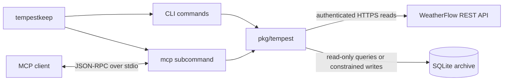

# Architecture

TempestKeep builds one Go 1.27.0 command over one shared core:

- `tempestkeep` owns setup, collection, export, reports, and terminal views.
- `tempestkeep mcp` exposes live and archived data over MCP stdio.
- `pkg/tempest` owns the API client, model, collector, configuration, and store.

## API and collection path

The API client accepts a token and typed options. Construction performs no I/O.
Each blocking method takes a context. Requests have a per-attempt timeout, a
bounded retry policy, an 8 MiB body limit, and semantic entry limits. Errors omit
the request URL, token, response body, and station or device identifier.

Historical responses contain `obs_st` arrays. The model validates the array
width, epoch, numeric fields, and physical bounds. It copies retained pointer
values. One malformed row rejects the complete response.

The collector requests no more than five days per API call. It commits each
chunk before reporting progress. A failed later chunk does not remove an earlier
commit. The caller receives the next resume epoch. One `Backfiller` accepts one
operation at a time.

Open-ended collection writes a cursor after each committed chunk. It writes a
completion marker after reaching the start of available history. Incremental
sync starts after the stored watermark.

## SQLite ownership

`store.Writer` creates the parent directory, file, and schema. It owns one
writable database handle in WAL mode. It validates a full batch before opening a
transaction. Inserts use `INSERT OR IGNORE` on `(device_id, epoch)`.

The first writer binds an archive to one positive device ID. A later writer must
use the same ID. This rule prevents mixed-device aggregates.

`store.Store` opens an existing regular file. It uses URI read-only mode,
`PRAGMA query_only`, a busy timeout, and one pooled connection. It does not
create or migrate a file. Both handles reject symlinks and file replacement
during open.

The read-only SQL operation accepts one `SELECT` or `WITH ... SELECT`. It also
uses SQLite `query_only`. It limits query bytes, execution time, columns, rows,
and returned bytes.

## Files and backups

Use a local filesystem for the active archive. Stop writers before moving data.
Copy a completed backup or export between machines.

After collection, the CLI checkpoints the WAL. It copies the database to an
owner-only temporary file, syncs and closes it, then publishes it with an atomic
no-overwrite link. Rotation recognizes only the exact timestamped filename
format and preserves unrelated files.

## Time and units

Epochs are UTC seconds. Stored values use Celsius, metres per second,
millibars, millimetres, kilometres, lux, and watts per square metre. Display
surfaces convert units at their documented boundary.

Calendar queries use the process timezone. Set `TZ` to the station's IANA
timezone before calendar reports when the host uses different timezone rules.

## MCP capabilities

The server registers only supported capabilities:

- A token enables live operations.
- An archive enables history and read-only queries.
- A token and writable archive enable bounded backfill and sync.
- `--read-only` removes write operations.

Stdout carries MCP JSON-RPC only. Stderr carries bounded, redacted diagnostics.
The server does not log local archive paths, tokens, response bodies, station
coordinates, serial numbers, or raw identifiers.

## Verification

`make verify` runs formatting, import, module, vet, unit, integration, race,
fuzz, lint, generated API, vulnerability, license, SBOM, secret, pure-Go, and
Linux ARM64 checks. It also checks GitHub Actions with pinned actionlint. See
[testing/properties.md](testing/properties.md) and
[threat-model.md](threat-model.md).
