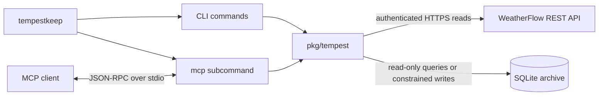

# Architecture

TempestKeep builds one Go 1.27.0 command over one shared core:

- `tempestkeep` owns setup, collection, export, reports, and terminal views.
- `tempestkeep mcp` exposes live and archived data over MCP stdio.
- `pkg/tempest` owns the API client, model, collector, configuration, and store.

```mermaid
flowchart LR
    WF[WeatherFlow REST API]
    APP[tempestkeep]
    CLI[CLI commands]
    MCP[mcp subcommand]
    CORE[pkg/tempest]
    DB[(SQLite archive)]
    CLIENT[MCP client]

    APP --> CLI
    APP --> MCP
    CLI --> CORE
    MCP --> CORE
    CORE -->|authenticated HTTPS reads| WF
    CORE -->|read-only queries or constrained writes| DB
    CLIENT <-->|JSON-RPC over stdio| MCP
```

## API and collection path

The API client accepts a token and typed options. Construction performs no I/O.
Each blocking method takes a context. Requests have a per-attempt timeout, a
bounded retry policy, an 8 MiB body limit, and semantic entry limits. Retryable
responses include HTTP 408, 429, and 5xx. Delays include random variation, called
jitter. Retry-After is honored up to the configured maximum wait, including
values too large to fit a duration. Errors omit the request URL, token,
response body, and station or device identifier. Sanitized transport timeouts
still match `context.DeadlineExceeded` and `api.ErrTransport`.

Historical collection accepts `obs_st` arrays from Tempest devices. The client
rejects an explicit different observation type, mismatched device ID, failed API
status, or observation outside the requested range. Missing optional identity
fields remain compatible with older responses.

The model validates array width, epoch, numeric fields, and physical bounds.
It copies retained pointer values. One malformed row rejects the complete
response. The client does not cache rejected JSON or observation responses.

The collector requests no more than five days per API call. It commits each
chunk before reporting progress. A failed later chunk does not remove an earlier
commit. The caller receives the next resume epoch. One `Backfiller` accepts one
operation at a time.

Open-ended collection writes a cursor after each committed chunk. It writes a
completion marker when the backward walk exhausts available history. A saved
cursor at epoch zero is a terminal boundary, not missing metadata. Incremental
sync starts after the stored watermark. During bounded MCP catch-up, private
metadata also preserves successful empty windows across calls and restarts.
After catch-up completes, the next sync rechecks the tail after the watermark.

MCP work budgets limit each backward call's requested history. Empty-history
progress survives bounded calls and restarts. One MCP server serializes its
archive write workflows. Separate server processes do not share that
coordination, so avoid overlapping collectors for one archive.

## SQLite ownership

`store.Writer` creates the parent directory, file, and schema. It owns one
writable database handle in WAL mode. It validates a full batch before opening a
transaction. Inserts use `INSERT OR IGNORE` on `(device_id, epoch)`.

Collection binds an archive to one positive device ID. Later writes must use
the same ID. This rule prevents mixed-device aggregates.

`store.Store` opens an existing regular file. It uses URI read-only mode,
`PRAGMA query_only`, a busy timeout, and one pooled connection. It does not
create or migrate a file. Both handles reject symlinks and file replacement
during open.

The read-only SQL operation accepts one `SELECT` or `WITH ... SELECT`. It also
uses SQLite `query_only`. It limits query bytes, execution time, columns, rows,
and returned bytes. Connection-level limits restrict large SQLite expressions
before the result reaches Go. The operation restores prior connection limits
before returning the connection to the pool.

The SQL result limit is not a bound on the whole process's memory. SQLite
can allocate temporary data while evaluating a query. Results must contain
finite numbers that JSON can represent.

## Files and backups

Use a local filesystem for the active archive. Stop writers before moving data.
Copy a completed backup or export between machines.

After collection, the CLI checkpoints the write-ahead log (WAL), which holds
recent database changes. A busy or incomplete checkpoint prevents backup
creation. A successful checkpoint does not protect a later copy from a separate
writer, so other writers must remain stopped through that copy.

The CLI copies the database to an owner-only temporary file, syncs it, and
closes it. A filesystem hard link publishes the snapshot without replacing an
existing file. Rotation recognizes the exact timestamped filename format and
preserves unrelated files. Backups live beside the archive in `backups`.

## Time and units

Epochs are UTC seconds. Stored values use Celsius, meters per second,
millibars, millimeters, kilometers, lux, and watts per square meter. Display
surfaces convert units at their documented boundary.

Calendar queries use the process timezone. On Unix-like systems, set `TZ`
before startup when the station and host use different timezones. Native
Windows uses the host timezone. Queries do not infer timezone from the archive.
See the [query guide](querying.md) for date bounds and missing readings.

## MCP capabilities

The server registers only supported capabilities:

- A token enables live operations.
- An archive enables history and read-only queries.
- A token and writable archive enable bounded backfill and sync.
- `--read-only` removes write operations.

Stdout carries MCP JSON-RPC only. Stderr carries bounded, redacted diagnostics.
The server does not log local archive paths, tokens, response bodies, station
coordinates, serial numbers, or raw identifiers.

## Verification

`make verify` runs formatting, import, module, vet, unit, integration, race,
fuzz, lint, generated API, vulnerability, license, SBOM, secret, pure-Go, and
Linux ARM64 checks. It also checks GitHub Actions with pinned actionlint. See
[testing/properties.md](testing/properties.md) and
[threat-model.md](threat-model.md).
